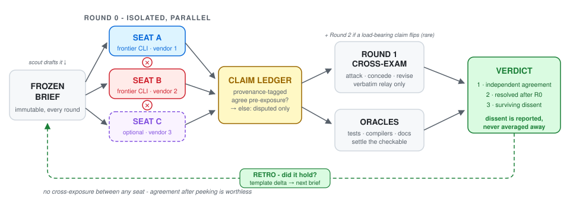

# Pressure-Test

<p align="center">
  <a href="LICENSE"></a>
  <a href="https://github.com/kdoubt/pressure-test/tags"></a>
  
  
</p>

> Adversarial AI review panels: AI CLIs from different vendors debate in
> structured rounds; adjudicated verdicts that preserve dissent. A
> methodology, not a framework.

<p align="center">
  <picture>
    <source media="(prefers-color-scheme: dark)" srcset="assets/workflow-dark.svg">
    
  </picture>
</p>

The loop, in one glance:

```
frozen brief ─▶ ROUND 0  seats answer in isolation (parallel, no peeking)
             ─▶ LEDGER   claims + falsifiers; pre-exposure agreement = settled
             ─▶ ROUND 1  disputed claims only, relayed verbatim - attack/concede/revise
             ─▶ ORACLES  tests · compilers · primary docs settle the checkable
             ─▶ VERDICT  1 agreement · 2 resolved · 3 surviving dissent (kept, not averaged)
             ─▶ RETRO    did it hold? whose dissent was right? → template delta → next brief
```

Built for developers who work with agentic CLIs and have no human review
board: the panel is your reviewers. One model reviewing its own plan
converges on its own blind spots; two *different* vendors' models, forced
to take independent positions and then cross-examine each other claim by
claim, catch what neither would alone - **if** the process prevents them
from politely agreeing their way to a wrong answer. Pressure-Test is that
process. You need two or more independently configured model/agent
commands from *different* vendors or model families (local or hosted;
subscriptions only where a provider requires one).

## When to use it

High-stakes, ambiguous, or irreversible decisions: architecture calls,
security boundaries, migrations, "is this even the right design." A panel
costs several model invocations and minutes of wall-clock per round -
spend it only where the expected loss of deciding wrong justifies it (see
`core/METHODOLOGY.md`, "When to convene").

Skip it for anything a test, compiler, or grep can settle. The first rule
of the methodology: **run the oracle before convening a debate.**

## How this differs from multi-agent debate / LLM-as-judge

Multi-agent debate and LLM-as-judge are well-studied, with mixed results -
mostly because agreement between models that have read each other is cheap.
Pressure-Test's mechanisms target exactly that:

- **Only pre-exposure agreement counts as consensus.** Round 0 is isolated
  and parallel; anything models agree on *after* seeing each other is
  never promoted to "the panel concludes".
- **Disputes route to oracles, not more debate.** Checkable claims go to
  tests, compilers, and primary documents; debate is reserved for what
  can't be checked.
- **Dissent survives into the verdict.** Unresolved disagreement is
  reported with the cheapest discriminating test - never averaged away.

## Getting started (allow 20-40 minutes the first time)

1. **Find your first panel.** Paste `core/templates/scout.md` into your own
   agentic CLI from your project's root: it reads *your* project and
   returns project-specific panel-worthy decisions (and what to leave to
   plain oracles), then drafts your first frozen brief.
2. **Pick an adapter.** For a first panel use one of the two maintained
   adapters - [`adapters/shell/`](adapters/shell/README.md) (any
   orchestrator, plain bash) or
   [`adapters/claude-code/`](adapters/claude-code/SKILL.md). The other
   adapter directories are contribution stubs.
   (`git clone https://github.com/kdoubt/pressure-test.git`)
3. **Run it.** Follow your adapter: freeze the brief
   ([template](core/templates/brief.md)), Round 0 in parallel with no
   cross-exposure, relay disputed claims verbatim, verify, adjudicate.
   Keep [`core/CONTRACT.md`](core/CONTRACT.md),
   [`core/LEDGER.md`](core/LEDGER.md), and
   [`core/VERDICT.md`](core/VERDICT.md) open as references; read
   [`core/METHODOLOGY.md`](core/METHODOLOGY.md) in full before your first
   *high-stakes* panel.

## Proof

The panel that designed this methodology is in
[`examples/sample-run/`](examples/sample-run/): seat A proposed three
debate rounds and blinded relay; seat B a two-round cap and mandatory
attribution - neither saw the other first. Both conceded specific points
under cross-examination; attribution and tie-breaking stayed contested and
are recorded as surviving dissent, not smoothed over. **Note:** it is a
historical bootstrap transcript - it predates the finalized templates and
relays full Round 0 essays, which the finalized method bans; learn the
loop from `core/templates/`, not from its file shapes.

## Repository layout

```
core/METHODOLOGY.md     the method: rounds, stop rules, failure modes
core/CONTRACT.md        orchestrator + seat obligations (MUST/SHOULD)
core/LEDGER.md          the claim ledger: fields, status enum, dispute rule
core/VERDICT.md         verdict format: three buckets, mode tags
core/templates/         scout, brief, per-round prompts, ledger, verdict, retro
examples/sample-run/    the real (historical) panel that designed the method
adapters/claude-code/   run panels from Claude Code (installable skill)
adapters/shell/         run panels from any shell - no orchestrator CLI needed
adapters/*/             other orchestrators (stubs - see CONTRIBUTING.md)
```

(`core/` is normative and orchestrator-neutral; adapters translate host
mechanics only and may never redefine rounds, ledger states, grounding, or
verdict rules.)

## Status

v0.1.0, and every rule in `core/` was earned the hard way: the methodology
was designed by running it on itself, then hardened by a ten-seat,
three-vendor review panel before release. The receipts are in the repo -
the founding debate lives in `examples/sample-run/`, and the failure modes
documented in METHODOLOGY (silent seat deaths, politeness convergence,
context poisoning) were each caught in real runs, not imagined. It is in
active use by its maintainer, Square Post Labs Inc., where it has already
overturned its own authors' designs more than once.

What it wants next is independent runs. Each adapter's README states its
own status; `CONTRIBUTING.md` has the support policy and the most-wanted
contribution: a sanitized panel run on a real engineering decision.

## License

MIT - see `LICENSE`.
